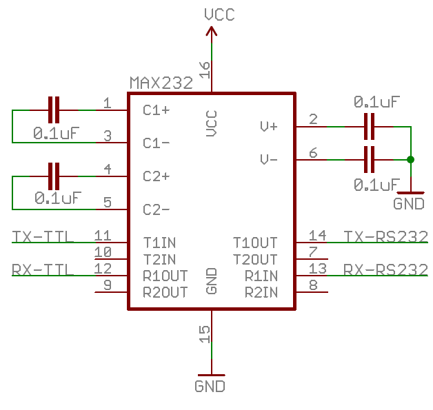

## Based on

https://community.home-assistant.io/t/zehnder-comfoair-ca350-integration-via-serial-connection-rs232-and-mqtt/173243/337 (home assistant topic)  
https://github.com/wichers/esphome-comfoair (original)  
https://github.com/nyxnyx/esphome-comfoair (as component)  
https://github.com/julianpas/esphome-comfoair (proxy between comfoD and ComfoSense)  
https://github.com/Oxyd69/esphome-comfoair (adjusted for ESPhome 2023.09)

# Parts used
## Wemos D32 pro
UART2 tx=1, rx=3  
UART2 tx=14, rx=12  
UART3 rx=32, tx=33  
https://forum.arduino.cc/t/using-hidden-uarts-in-lolin-d32-pro/608288/4

## [Sparkfun MAX2323 beakout board](https://www.sparkfun.com/products/11189)

  

# Custom PCB (fritzing)
## Breadboard

## Schema

## PCB

